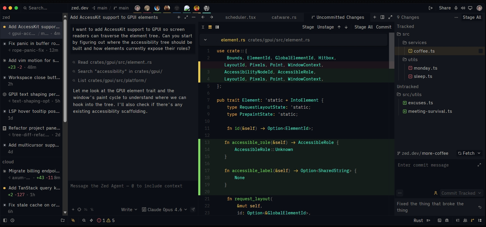
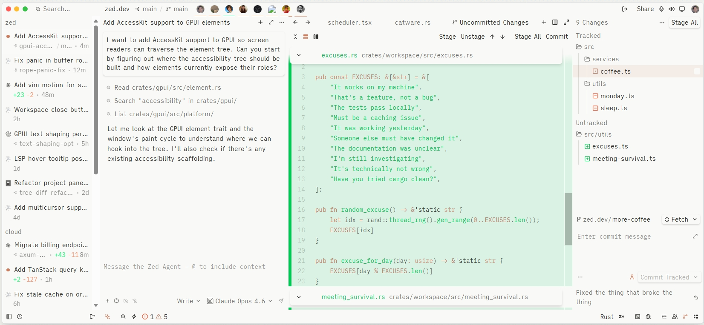
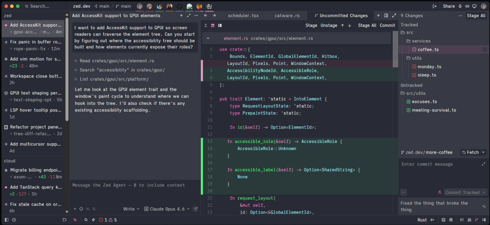
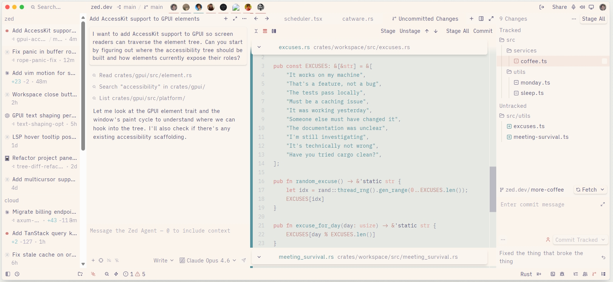
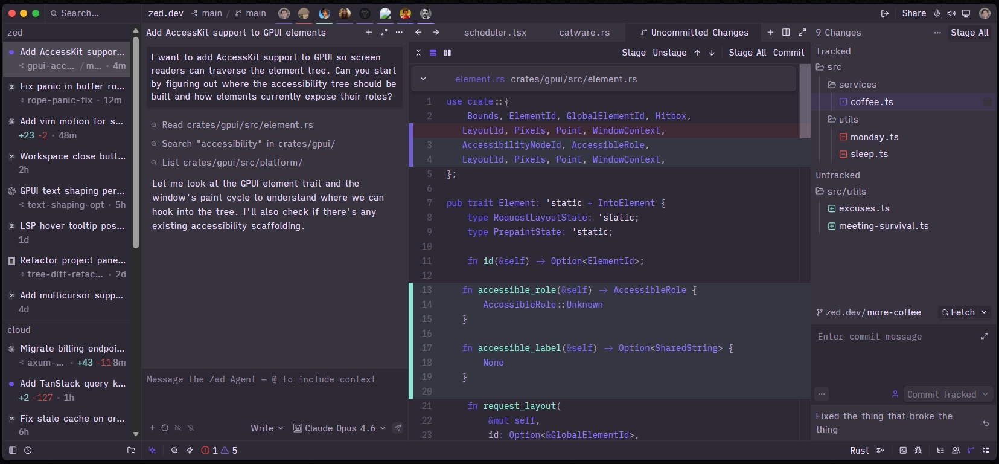

# Deadleaf Theme

A collection of 41+ carefully crafted light and dark themes for Zed IDE.

## Sample Theme Previews


### Ayu Dark



### Absolutely Light



### Dracula Dark



### Rose-Pine Light



### Sentry Dark



## Themes

### Dark Themes (21)

| Theme | Surface | Ink | Accent |
|-------|----------|------|--------|
| Codex Dracula | `#282a36` | `#f8f8f2` | `#ff79c6` |
| Codex Absolutely | `#2d2d2b` | `#f9f9f7` | `#cc7d5e` |
| Codex Ayu | `#0b0e14` | `#bfbdb6` | `#e6b450` |
| Codex Catppuccin | `#1e1e2e` | `#cdd6f4` | `#cba6f7` |
| Codex Codex | `#111111` | `#fcfcfc` | `#0169cc` |
| Codex Everforest | `#2d353b` | `#d3c6aa` | `#a7c080` |
| Codex GitHub | `#0d1117` | `#e6edf3` | `#1f6feb` |
| Codex Gruvbox | `#282828` | `#ebdbb2` | `#458588` |
| Codex Linear | `#0f0f11` | `#e3e4e6` | `#606acc` |
| Codex Lobster | `#111827` | `#e4e4e7` | `#ff5c5c` |
| Material | `#212121` | `#eeffff` | `#80cbc4` |
| Matrix | `#040805` | `#b8ffca` | `#1eff5a` |
| Monokai | `#272822` | `#f8f8f2` | `#99947c` |
| Night Owl | `#011627` | `#d6deeb` | `#44596b` |
| Nord | `#2e3440` | `#d8dee9` | `#88c0d0` |
| Notion | `#191919` | `#d9d9d8` | `#3183d8` |
| One | `#282c34` | `#abb2bf` | `#4d78cc` |
| Oscurange | `#0b0b0f` | `#e6e6e6` | `#f9b98c` |
| Raycast | `#101010` | `#fefefe` | `#ff6363` |
| Sentry | `#2d2935` | `#e6dff9` | `#7055f6` |
| Rose Pine | `#232136` | `#e0def4` | `#ea9a97` |
| Solarized | `#002b36` | `#839496` | `#d30102` |
| Temple | `#02120c` | `#c7e6da` | `#e4f222` |
| Tokyo Night | `#1a1b26` | `#a9b1d6` | `#3d59a1` |
| Vercel | `#000000` | `#ededed` | `#006efe` |
| VS Code Plus | `#1e1e1e` | `#d4d4d4` | `#007acc` |

### Light Themes (13)

| Theme | Surface | Ink | Accent |
|-------|----------|------|--------|
| Absolutely Light | `#f9f9f7` | `#2d2d2b` | `#cc7d5e` |
| Catppuccin Light | `#eff1f5` | `#4c4f69` | `#8839ef` |
| Codex Light | `#ffffff` | `#0d0d0d` | `#0169cc` |
| Everforest Light | `#fdf6e3` | `#5c6a72` | `#93b259` |
| GitHub Light | `#ffffff` | `#1f2328` | `#0969da` |
| Gruvbox Light | `#fbf1c7` | `#3c3836` | `#458588` |
| Linear Light | `#fcfcfd` | `#1b1b1b` | `#5e6ad2` |
| Notion Light | `#ffffff` | `#37372f` | `#3183d8` |
| One Light | `#fafafa` | `#383a42` | `#526fff` |
| Proof | `#f5f3ed` | `#2f312d` | `#3d755d` |
| Raycast Light | `#ffffff` | `#030303` | `#ff6363` |
| Rose Pine Light | `#faf4ed` | `#575279` | `#d7827e` |
| Solarized Light | `#fdf6e3` | `#657b83` | `#b58900` |
| Vercel Light | `#ffffff` | `#171717` | `#006aff` |
| VS Code Plus Light | `#ffffff` | `#000000` | `#007acc` |

## Installation

### From Zed Extensions

1. Open Zed settings (Cmd+, or Ctrl+,)
2. Search for "deadleaf themes"
3. Click Install

### Manual Installation

1. Clone this repository
2. Open Zed and run "Extensions: Install Dev Extension"
3. Select the cloned directory

## Features

- **41 themes** covering popular dark and light variants
- **Systematic color derivation** - all colors derived from core palette (surface, ink, accent, semanticColors)
- **Semantic token support** - enhanced syntax highlighting for Rust (rust-analyzer) and other languages
- **Complete UI coverage** - 149+ style keys per theme
- **ANSI terminal colors** - derived from theme palette for consistent terminal experience

## Semantic Tokens

This extension supports semantic tokens for enhanced syntax highlighting. To enable:

1. Open Zed settings (Cmd+, or Ctrl+,)
2. Add the following to your settings:

```json
{
  "semantic_tokens": "combined",
  "global_lsp_settings": {
    "semantic_token_rules": [
      {
        "token_type": "variable",
        "token_modifiers": ["mutable"],
        "underline": true
      },
      {
        "token_type": "selfKeyword",
        "token_modifiers": ["mutable"],
        "underline": true
      },
      {
        "token_type": "parameter",
        "token_modifiers": ["mutable"],
        "underline": true
      },
      {
        "token_type": "namespace",
        "token_modifiers": ["procMacro", "attribute"],
        "style": ["string"]
      },
      {
        "token_type": "enum",
        "token_modifiers": ["procMacro", "attribute"],
        "style": ["string"]
      },
      {
        "token_type": "namespace",
        "token_modifiers": ["crateRoot"],
        "style": ["namespace.crateRoot"]
      },
      {
        "token_type": "attributeBracket",
        "style": ["attribute"]
      },
      {
        "token_type": "operator",
        "token_modifiers": ["attribute"],
        "style": ["attribute"]
      },
      {
        "token_type": "derive",
        "token_modifiers": ["defaultLibrary"],
        "style": ["type.interface"]
      },
      {
        "token_type": "derive",
        "token_modifiers": ["library"],
        "style": ["function"]
      },
      {
        "token_type": "operator",
        "token_modifiers": ["controlFlow"],
        "style": ["operator.controlFlow"]
      },
      {
        "token_type": "macro",
        "style": ["function.special"]
      },
      {
        "token_type": "procMacro",
        "style": ["function.special"]
      },
      {
        "token_type": "builtinType",
        "style": ["type.builtin"]
      },
      {
        "token_type": "method",
        "token_modifiers": ["trait"],
        "font_style": "italic"
      },
      {
        "token_type": "typeParameter",
        "style": ["type.parameter"]
      },
      {
        "token_type": "selfTypeKeyword",
        "style": ["keyword"]
      },
      {
        "token_type": "formatSpecifier",
        "style": ["keyword"]
      }
    ]
  }
}
```

## Author

Abdelrahman Habib - abdelrahman.habib.dev@proton.me

## License

MIT
